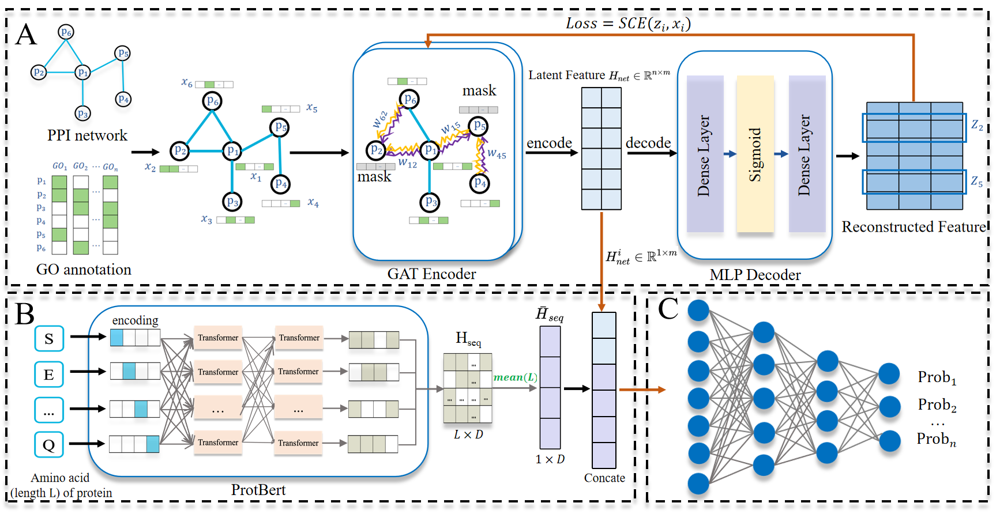

<p>
	
	<br />

</p>

<h1> PrePSL: A Pre-training Method for Protein
Subcellular Localization Using Graph Auto-Encoder
and Protein Language Model </h1>

PrePSL is a pre-trained protein subcellular localization method, which achieves competitive or better performance than existing state-of-the-art methods on protein subcellular localization.
<h2>Installation</h2>

The required packages can be installed by running `pip install -r requirements.txt`.
<h2>Datasets</h2>
The raw datasets used in our paper can be downlowad from：

[https://github.com/Paeans/subcellular](https://github.com/Paeans/subcellular)

<h2>Quick Start</h2>

**get net embedding**

```
python get_net_embedding/main.py
```

**get sequence embedding**
```
python get_sequence_embedding/get_sequence_embedding.py
```

**predict subcellular location**
```
python evolutation_fusion_feature_concat+kfold.py
```